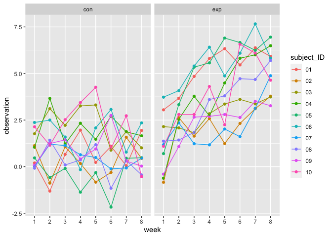
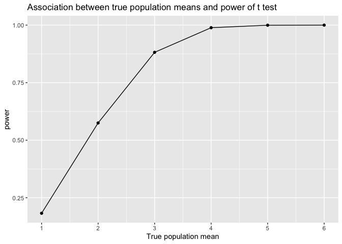

Homework-2
================

## Library calls

``` r
library(tidyverse)
```

    ## ── Attaching packages ─────────────────────────────────────── tidyverse 1.3.2 ──
    ## ✔ ggplot2 3.3.6      ✔ purrr   0.3.5 
    ## ✔ tibble  3.1.8      ✔ dplyr   1.0.10
    ## ✔ tidyr   1.2.1      ✔ stringr 1.4.1 
    ## ✔ readr   2.1.3      ✔ forcats 0.5.2 
    ## ── Conflicts ────────────────────────────────────────── tidyverse_conflicts() ──
    ## ✖ dplyr::filter() masks stats::filter()
    ## ✖ dplyr::lag()    masks stats::lag()

``` r
library(readxl)
```

## Problem 1

``` r
# create dataframe with all file names.

experiment_df = 
  tibble(
    filename = c(list.files("data"))
  )

# create function to read filenames
read_filename <- function(filename) {
  
  filename = str_c("data/", filename)
  file_data = read_csv(filename)
}

# add filedata and tidy dataset
experiment_df = experiment_df %>%
  mutate(
    file_data_list = purrr::map(filename, read_filename)
  ) %>%
  unnest(file_data_list) %>%
  mutate(
    filename = str_replace(filename, ".csv", ""),
    group = str_sub(filename, 1, 3), 
    subject_ID = str_sub(filename, 5)
  )
```

    ## Rows: 1 Columns: 8
    ## ── Column specification ────────────────────────────────────────────────────────
    ## Delimiter: ","
    ## dbl (8): week_1, week_2, week_3, week_4, week_5, week_6, week_7, week_8
    ## 
    ## ℹ Use `spec()` to retrieve the full column specification for this data.
    ## ℹ Specify the column types or set `show_col_types = FALSE` to quiet this message.
    ## Rows: 1 Columns: 8
    ## ── Column specification ────────────────────────────────────────────────────────
    ## Delimiter: ","
    ## dbl (8): week_1, week_2, week_3, week_4, week_5, week_6, week_7, week_8
    ## 
    ## ℹ Use `spec()` to retrieve the full column specification for this data.
    ## ℹ Specify the column types or set `show_col_types = FALSE` to quiet this message.
    ## Rows: 1 Columns: 8
    ## ── Column specification ────────────────────────────────────────────────────────
    ## Delimiter: ","
    ## dbl (8): week_1, week_2, week_3, week_4, week_5, week_6, week_7, week_8
    ## 
    ## ℹ Use `spec()` to retrieve the full column specification for this data.
    ## ℹ Specify the column types or set `show_col_types = FALSE` to quiet this message.
    ## Rows: 1 Columns: 8
    ## ── Column specification ────────────────────────────────────────────────────────
    ## Delimiter: ","
    ## dbl (8): week_1, week_2, week_3, week_4, week_5, week_6, week_7, week_8
    ## 
    ## ℹ Use `spec()` to retrieve the full column specification for this data.
    ## ℹ Specify the column types or set `show_col_types = FALSE` to quiet this message.
    ## Rows: 1 Columns: 8
    ## ── Column specification ────────────────────────────────────────────────────────
    ## Delimiter: ","
    ## dbl (8): week_1, week_2, week_3, week_4, week_5, week_6, week_7, week_8
    ## 
    ## ℹ Use `spec()` to retrieve the full column specification for this data.
    ## ℹ Specify the column types or set `show_col_types = FALSE` to quiet this message.
    ## Rows: 1 Columns: 8
    ## ── Column specification ────────────────────────────────────────────────────────
    ## Delimiter: ","
    ## dbl (8): week_1, week_2, week_3, week_4, week_5, week_6, week_7, week_8
    ## 
    ## ℹ Use `spec()` to retrieve the full column specification for this data.
    ## ℹ Specify the column types or set `show_col_types = FALSE` to quiet this message.
    ## Rows: 1 Columns: 8
    ## ── Column specification ────────────────────────────────────────────────────────
    ## Delimiter: ","
    ## dbl (8): week_1, week_2, week_3, week_4, week_5, week_6, week_7, week_8
    ## 
    ## ℹ Use `spec()` to retrieve the full column specification for this data.
    ## ℹ Specify the column types or set `show_col_types = FALSE` to quiet this message.
    ## Rows: 1 Columns: 8
    ## ── Column specification ────────────────────────────────────────────────────────
    ## Delimiter: ","
    ## dbl (8): week_1, week_2, week_3, week_4, week_5, week_6, week_7, week_8
    ## 
    ## ℹ Use `spec()` to retrieve the full column specification for this data.
    ## ℹ Specify the column types or set `show_col_types = FALSE` to quiet this message.
    ## Rows: 1 Columns: 8
    ## ── Column specification ────────────────────────────────────────────────────────
    ## Delimiter: ","
    ## dbl (8): week_1, week_2, week_3, week_4, week_5, week_6, week_7, week_8
    ## 
    ## ℹ Use `spec()` to retrieve the full column specification for this data.
    ## ℹ Specify the column types or set `show_col_types = FALSE` to quiet this message.
    ## Rows: 1 Columns: 8
    ## ── Column specification ────────────────────────────────────────────────────────
    ## Delimiter: ","
    ## dbl (8): week_1, week_2, week_3, week_4, week_5, week_6, week_7, week_8
    ## 
    ## ℹ Use `spec()` to retrieve the full column specification for this data.
    ## ℹ Specify the column types or set `show_col_types = FALSE` to quiet this message.
    ## Rows: 1 Columns: 8
    ## ── Column specification ────────────────────────────────────────────────────────
    ## Delimiter: ","
    ## dbl (8): week_1, week_2, week_3, week_4, week_5, week_6, week_7, week_8
    ## 
    ## ℹ Use `spec()` to retrieve the full column specification for this data.
    ## ℹ Specify the column types or set `show_col_types = FALSE` to quiet this message.
    ## Rows: 1 Columns: 8
    ## ── Column specification ────────────────────────────────────────────────────────
    ## Delimiter: ","
    ## dbl (8): week_1, week_2, week_3, week_4, week_5, week_6, week_7, week_8
    ## 
    ## ℹ Use `spec()` to retrieve the full column specification for this data.
    ## ℹ Specify the column types or set `show_col_types = FALSE` to quiet this message.
    ## Rows: 1 Columns: 8
    ## ── Column specification ────────────────────────────────────────────────────────
    ## Delimiter: ","
    ## dbl (8): week_1, week_2, week_3, week_4, week_5, week_6, week_7, week_8
    ## 
    ## ℹ Use `spec()` to retrieve the full column specification for this data.
    ## ℹ Specify the column types or set `show_col_types = FALSE` to quiet this message.
    ## Rows: 1 Columns: 8
    ## ── Column specification ────────────────────────────────────────────────────────
    ## Delimiter: ","
    ## dbl (8): week_1, week_2, week_3, week_4, week_5, week_6, week_7, week_8
    ## 
    ## ℹ Use `spec()` to retrieve the full column specification for this data.
    ## ℹ Specify the column types or set `show_col_types = FALSE` to quiet this message.
    ## Rows: 1 Columns: 8
    ## ── Column specification ────────────────────────────────────────────────────────
    ## Delimiter: ","
    ## dbl (8): week_1, week_2, week_3, week_4, week_5, week_6, week_7, week_8
    ## 
    ## ℹ Use `spec()` to retrieve the full column specification for this data.
    ## ℹ Specify the column types or set `show_col_types = FALSE` to quiet this message.
    ## Rows: 1 Columns: 8
    ## ── Column specification ────────────────────────────────────────────────────────
    ## Delimiter: ","
    ## dbl (8): week_1, week_2, week_3, week_4, week_5, week_6, week_7, week_8
    ## 
    ## ℹ Use `spec()` to retrieve the full column specification for this data.
    ## ℹ Specify the column types or set `show_col_types = FALSE` to quiet this message.
    ## Rows: 1 Columns: 8
    ## ── Column specification ────────────────────────────────────────────────────────
    ## Delimiter: ","
    ## dbl (8): week_1, week_2, week_3, week_4, week_5, week_6, week_7, week_8
    ## 
    ## ℹ Use `spec()` to retrieve the full column specification for this data.
    ## ℹ Specify the column types or set `show_col_types = FALSE` to quiet this message.
    ## Rows: 1 Columns: 8
    ## ── Column specification ────────────────────────────────────────────────────────
    ## Delimiter: ","
    ## dbl (8): week_1, week_2, week_3, week_4, week_5, week_6, week_7, week_8
    ## 
    ## ℹ Use `spec()` to retrieve the full column specification for this data.
    ## ℹ Specify the column types or set `show_col_types = FALSE` to quiet this message.
    ## Rows: 1 Columns: 8
    ## ── Column specification ────────────────────────────────────────────────────────
    ## Delimiter: ","
    ## dbl (8): week_1, week_2, week_3, week_4, week_5, week_6, week_7, week_8
    ## 
    ## ℹ Use `spec()` to retrieve the full column specification for this data.
    ## ℹ Specify the column types or set `show_col_types = FALSE` to quiet this message.
    ## Rows: 1 Columns: 8
    ## ── Column specification ────────────────────────────────────────────────────────
    ## Delimiter: ","
    ## dbl (8): week_1, week_2, week_3, week_4, week_5, week_6, week_7, week_8
    ## 
    ## ℹ Use `spec()` to retrieve the full column specification for this data.
    ## ℹ Specify the column types or set `show_col_types = FALSE` to quiet this message.

``` r
# mutate data to long version for spaghetti plot

experiment_df = 
  pivot_longer(
    experiment_df, 
    week_1:week_8,
    names_to = "week",
    values_to = "observation",
    names_prefix = "week_"
  )
  
# create spaghetti plot

experiment_plot =
  experiment_df %>%
  ggplot(aes(x = week, y = observation, group = subject_ID, color = subject_ID)) +
  geom_point() +
  geom_path() +
  facet_grid(~group)
experiment_plot
```

<!-- -->

## Problem 2

``` r
#load data and clean names
homicide_df = read_csv("homicide-data.csv") %>%
  janitor::clean_names()
```

    ## Rows: 52179 Columns: 12
    ## ── Column specification ────────────────────────────────────────────────────────
    ## Delimiter: ","
    ## chr (9): uid, victim_last, victim_first, victim_race, victim_age, victim_sex...
    ## dbl (3): reported_date, lat, lon
    ## 
    ## ℹ Use `spec()` to retrieve the full column specification for this data.
    ## ℹ Specify the column types or set `show_col_types = FALSE` to quiet this message.

Describe raw data:

``` r
# create city_state variable
homicide_df = homicide_df %>%
  mutate(
    city_state = str_c(city, ", ",state)
  )
# Summarize within cities to obtain the total number of homicides and the number of unsolved homicides (those for which the disposition is “Closed without arrest” or “Open/No arrest”)
total_homicides_df = homicide_df %>%
  group_by(city) %>%
  count() %>%
  rename("total_homicides" = n)

unsolved_homicides_df = homicide_df %>%
  group_by(city) %>%
  filter(disposition %in% c("Closed without arrest", "Open/No arrest")) %>%
  count() %>%
  rename("unsolved_homicides" = n)

homicide_df = left_join(total_homicides_df, unsolved_homicides_df)
```

    ## Joining, by = "city"

``` r
# Prop.test for Baltimore
baltimore_homicides = homicide_df %>%
  filter(city == "Baltimore")

balt_prop_test = prop.test(x = baltimore_homicides$unsolved_homicides, n = baltimore_homicides$total_homicides) %>%
  broom::tidy() %>%
  select(estimate, conf.low, conf.high) %>%
  mutate(
    CI = str_c(conf.low, ",", conf.high)
  )
balt_prop_test
```

    ## # A tibble: 1 × 4
    ##   estimate conf.low conf.high CI                                 
    ##      <dbl>    <dbl>     <dbl> <chr>                              
    ## 1    0.646    0.628     0.663 0.627562457662644,0.663159860401662

``` r
# Run prop.test for each of the cities in your dataset, and extract both the proportion of unsolved homicides and the confidence interval for each city.

# create function to return tidy version of prop.test results
prop_test_results <- function(prop_x, prop_n) {
  
  prop_test_list = prop.test(prop_x, prop_n)
  prop_test_list = broom::tidy(prop_test_list)
}

# iterate over dataset to get desired output
homicide_df =
  homicide_df %>%
  mutate(
    prop_test_stats = map2(.x = unsolved_homicides, .y = total_homicides, ~ prop_test_results(prop_x = .x, prop_n = .y))) %>%
  unnest(cols = prop_test_stats) %>%
  select(city, estimate, conf.low, conf.high) %>%
  mutate(
    CI = str_c(conf.low, ", ", conf.high)
  )

# Create a plot that shows the estimates and CIs for each city – check out geom_errorbar for a way to add error bars based on the upper and lower limits. Organize cities according to the proportion of unsolved homicides.

homicide_plot = homicide_df %>%
  ggplot(aes(x = reorder(city, estimate), y = estimate)) +
  geom_point() +
  geom_errorbar(aes(ymin = conf.low, ymax = conf.high)) +
  theme(legend.position = "none", 
         axis.text.x = element_text(angle = 90, hjust = 1)) +
  xlab("City")
homicide_plot 
```

<!-- -->

## Problem 3

``` r
# Generate 5000 datasets from the model: x∼Normal[μ,σ].

## step 1: create function to generate required simulation data
sim_mean_pvalue = function(mu = 0, sigma = 5, samp_num = 30) {
  sim_data = tibble(
    x = rnorm(n = samp_num, mean = mu, sd = sigma),
  )
  sim_data %>% 
    summarize(
      mu_hat = mean(x),
      p_value = broom::tidy(t.test(x))[[3]],
    )
}

a_sampl = rnorm(30, 2, 0.5)
t.test(a_sampl)
```

    ## 
    ##  One Sample t-test
    ## 
    ## data:  a_sampl
    ## t = 25.077, df = 29, p-value < 2.2e-16
    ## alternative hypothesis: true mean is not equal to 0
    ## 95 percent confidence interval:
    ##  1.959785 2.307839
    ## sample estimates:
    ## mean of x 
    ##  2.133812

``` r
## step 2: Generate 5000 simulation datasets with mu=0, using the above function

sim0_results_df = 
  expand_grid(
    mu = 0,
    iter = 1:50
  ) %>% 
  mutate(
    estimate_df = map(mu, sim_mean_pvalue)
  ) %>% 
  unnest(estimate_df)
```

``` r
# Repeat the above for μ={1,2,3,4,5,6}
sim_results_df = 
  expand_grid(
    mu = c(1, 2, 3, 4, 5, 6),
    iter = 1:50
  ) %>% 
  mutate(
    estimate_df = map(mu, sim_mean_pvalue)
  ) %>% 
  unnest(estimate_df)
```

``` r
# Make a plot showing the proportion of times the null was rejected (the power of the test) on the y axis and the true value of μ on the x axis. Describe the association between effect size and power.

power_plot_df = sim_results_df %>%
  mutate(conclusion = if_else(p_value > 0.05, "Do not reject", "Reject")) %>%
  group_by(mu, conclusion) %>%
  summarise( n = n()) %>%
  mutate(
    power = n/sum(n)
  ) %>%
  filter(conclusion == "Reject") %>%
  select(mu, power)
```

    ## `summarise()` has grouped output by 'mu'. You can override using the `.groups`
    ## argument.

``` r
power_plot = power_plot_df %>%
  ggplot(aes(x = mu, y = power)) +
  geom_line() +
  geom_point() +
  xlab("True population mean") +
  scale_x_continuous(breaks = c(1, 2, 3, 4, 5, 6)) +
  ggtitle("Association between true population means and power of t test")
power_plot 
```

<!-- -->
Thus, we can see that power increases with increase in effect size.
